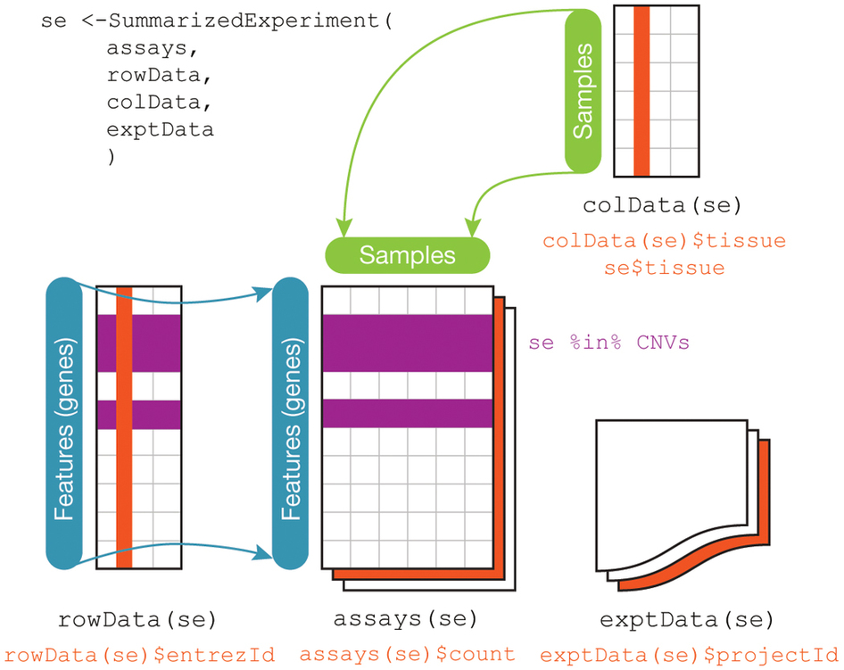

# A bedrock data structure

*Nota bene:* The majority of the following inconsistencies are resolved as of 
February 2018, and in fact were resolved some time ago, following the migration
of the old SummarizedExperiment class to RangedSummarizedExperiment in 2016.
  
*For posterity, here were the issues as of June 2015.*  

So hey, we have a complicated experiment and we'd like to summarize it. 

```R 
library(SummarizedExperiment)
nrows <- 200; ncols <- 6
counts <- matrix(runif(nrows * ncols, 1, 1e4), nrows)
rowRanges <- GRanges(rep(c("chr1", "chr2"), c(50, 150)),
                     IRanges(floor(runif(200, 1e5, 1e6)), width=100),
                     strand=sample(c("+", "-"), 200, TRUE),
                     feature_id=sprintf("ID%03d", 1:200))
colData <- DataFrame(Treatment=rep(c("ChIP", "Input"), 3),
                     row.names=LETTERS[1:6])
rse <- SummarizedExperiment(assays=SimpleList(counts=counts),
                            rowRanges=rowRanges, colData=colData)
```

Said experiment involves a lot of flat priors.

---

# wat (part I) 

However, apparently that's not what the function does?

```R
is(SummarizedExperiment(), "SummarizedExperiment")
```
```
# bioc-release behavior as of June 2015
FALSE 
```
```
# bioc-release behavior as of February 2018
TRUE
```
So, this has been fixed. 

---

# wat (part II)

OK so maybe the previous example was silly, what about this?

```R
is(SummarizedExperiment(assays=SimpleList(counts=counts),
                        rowRanges=rowRanges, colData=colData),
   "SummarizedExperiment")
```
```
# bioc-release behavior as of June 2015
FALSE 
```
```
# bioc-release behavior as of February 2018
TRUE
```
So, this has also been fixed.

---

# wat (part III)

Fine, what about the previous-release behavior?

```R
is(GenomicRanges:::SummarizedExperiment(counts, rowRanges, colData),
   "SummarizedExperiment")
```
```
# bioc-release behavior as of June 2015
FALSE 
```
```
# bioc-release behavior as of February 2018
Error in get(name, envir = asNamespace(pkg), inherits = FALSE) : 
  object 'SummarizedExperiment' not found
```

But this *did* migrate to an entirely new package, and `:::` is poor form. 

---

# No worries, this is just for internal use

*Reminder: These complaints are out of date, as is any published paper.*

Unless anyone reads the [Nature Methods paper](http://www.nature.com/nmeth/journal/v12/n2/fig_tab/nmeth.3252_F2.html)



---

# I'm so excited about this thing I saw in Nature Methods!!1

*Reminder: These complaints are out of date, as is any published paper.*

```R 
se <- GenomicRanges:::SummarizedExperiment(counts, rowRanges, colData)
rowData(se)
```
```
# bioc-release behavior as of June 2015
Error: 'rowData' is defunct.
Use 'rowRanges' instead.
See help("Defunct")
```
```
# bioc-release behavior as of February 2018
Error in get(name, envir = asNamespace(pkg), inherits = FALSE) : 
  object 'SummarizedExperiment' not found
```

[That was not consistent with BioC deprecation guidelines](http://www.bioconductor.org/developers/how-to/deprecation/http://www.bioconductor.org/developers/how-to/deprecation/)
Speaking as a chump who actually followed the rules, this was a drag.
(You could always argue that WORKING protocols go in Nature Protocols, however.)

---

# Bonus!  For Nature Methods readers

Proving once again that anything published is already out of date:  

```R
exptData(se)
```
```
# bioc-release behavior as of June 2015
List of length 0
Warning message:
'exptData' is deprecated.
Use 'metadata' instead.
See help("Deprecated") 
```
```
# bioc-release behavior as of February 2018
Error in exptData(se) : could not find function "exptData"
```

*2015*: at least it's not defunct() yet like that other one. 
*2018*: well, it's not like we weren't warned. 

Thankfully, after a mildly painful transition, most of this is ancient history.

---

# Fin 
